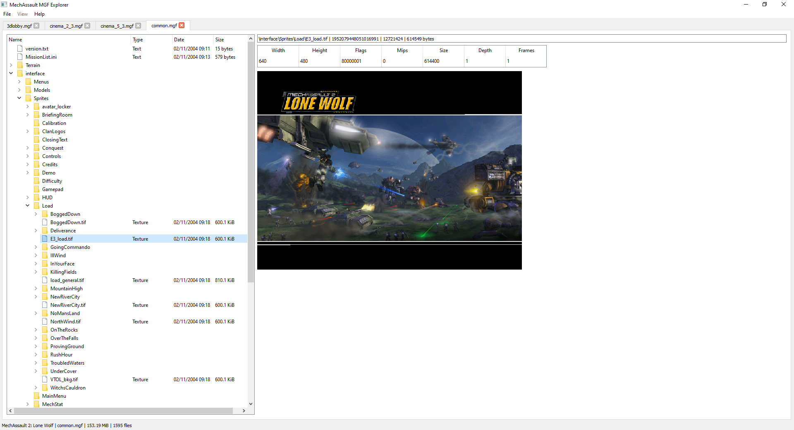
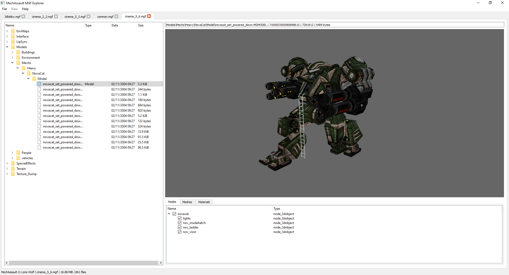

# About
MGF Explorer is a C++/Qt GUI tool for opening and viewing assets contained within Meyer/Glass Interactive archive files used in MechAssault and MechAssault 2: Lone Wolf. This tool is heavily inspired by Adjutant, a similar tool for browsing .map files used in the Halo games. Please note that this application is early in development and a lot of features are not complete, especially the model viewer. MGF Explorer can open textures (.tif), models (.node and .mgmodel), and localised string tables (.mgtext) from both games. You can also extract files as they are - conversion to common formats isn't implemented yet.

## Screenshots



# Current features
* Open MGF archive files and display the contents, preserving the directory tree structure
* Model viewer
  * Can open both .mgmodel files (MA2) and .node files (MA1 and MA2)
  * Displays the node hierarchy, animations, meshes and materials
  * Nodes can be toggled on and off to hide/view meshes
* Texture viewer that can open and preview almost all textures found in an MGF file
* File extraction
  * Only raw file extraction for now
	
# Planned features
* Converting assets to common 3rd party formats (i.e. textures to PNG, models to FBX, etc)
* File injection
* Animations in the model viewer

# How to use MGF Explorer

## What is an MGF file?
MGF files are found on the discs for MechAssault 1 and MechAssault 2: Lone Wolf. They contain assets such as config/ini files, textures, 3D models, level data, and many other types of files.
Every level in MechAssault - campaign mission/cinematic or multiplayer map - has an MGF file associated with it containing all the assets needed for that level. There's also common.mgf (assets needed for the title screen), text.mgf (localised string tables), and movies.mgf (bink files).
To acquire the MGF files, you will need to extract the contents of your MechAssault 1/2 disc. There are a two ways to do this:
* Download an image dump of MechAssault on archive.org and find some tools to extract the image
* If you have a modded Xbox, you can copy files from your disc directly and FTP them to your PC

## Opening MGF files
The MGF files stored on disc are initially compressed. At this time, MGF Explorer cannot decompress the files itself, so you will need to use another tool first.
To decompress the files:
1. Acquire the MGF files and save them to a folder on your PC
2. [Download offzip](https://aluigi.altervista.org/mytoolz/offzip.zip) and extract offzip.exe to your folder containing the MGF files
3. Open the command prompt and run the following commands
```
cd <your mgf folder>
for %f in (*.mgf) do offzip.exe -a -1 %f <destination>/%f
```
Replace <your mgf folder> with the path to your folder containing your MGF files
Replace <destination> with a different file path where you want the decompressed files to go

`text.mgf` and `movies.mgf` will fail - these two files aren't actually compressed.

## Using MGF Explorer
Once your mgf files are decompressed, they can now be opened by MGF Explorer. To open a file:
1. Go to File > Open in MGF Explorer. You can select multiple files.
2. Wait for MGF Explorer to load the file(s).

Once an MGF file has been opened, you will see a tree view of all the folders and files inside. You can see the name of the folder/file, size, type, and date modified.

The type column identifies what the file is. If the type is not blank, click on the file and MGF Explorer will "open" the file on the right and allow you to inspect it. As of version 0.3, MGF Explorer can open:
* Textures (.tif)
* 3D Models (.MGMODEL and .NODE)
* String tables (.mgText)
* Text files (.ini, .cfg, .txt, .road)

### Texture viewer
The texture viewer opens when you click on a .tif file. You will see the texture itself and its properties such as width, height, flags, mipmaps, etc.
Some textures look broken. This is because they are swizzled (encoded in a certain way to make them more efficient to use in the game). I have yet to decode these.

### Text viewer
The text viewer opens when you click on any file containing plain text. It will simply show the text data to you. Not much more to say here.

### Model viewer
The model viewer opens when you click on any .mgmodel or .node file. You will get a 3D viewport showing you the model and some tabs below the viewport.
##### Viewport controls
The viewport has fly controls so you can inspect models easier.
* Click and hold either mouse button on the viewport to activate flight controls
* Use WASD to move the camera around
* Use Ctrl to descend and space to ascend
* Use the scroll wheel to adjust the camera speed
##### Nodes tab
Shows all the nodes for this 3D model in a tree view. You can also toggle the visibility of each node using the tickbox next to the node's name.
##### Animations tab
If this model has animations associated with it, you will see the Animations tab. Click on the tab to see the animations
##### Meshes
Lists all the meshes the model is made up of.
##### Materials
Lists all the materials applied to each mesh.

### String table viewer
Click any .mgText file (only found within text.mgf) to open the string table viewer. You will see a table of text and ID numbers associated with each piece of text.
This is used for localisation (i.e. translating the game to different languages). If you dig around the .ini files elsewhere, you'll sometimes see references to the IDs in here. This is so the text the player sees can be changed depending on the player's language.

### Extracting files
As of MGF Explorer 0.3, you can extract individual files from MGF files. As of 0.3.1, you can also extract textures (.tif files) as BMP and PNG images.
1. Right click any folder or file in the tree view.
  * Files that can be converted to other formats will show "Extract as <format>" in the drop down menu
2. Click "Extract..." to open the file extractor dialog. This dialog will show you a list of all the files queued for extraction.
3. Choose where you want to extract the files to with the "Browse" button at the top.
4. Toggle the options on the right to your preference.
5. Click "Extract" to begin the extraction. This can take a while. Be warned, as of v0.3, you cannot cancel the operation and there isn't great feedback on the progress. You will know it's finished when the "Extract" button changes to "Done".

# Credits
* https://www.qt.io/
* https://pugixml.org/
* https://www.ogre3d.org/
* https://github.com/Benjamin-Dobell/s3tc-dxt-decompression
* https://github.com/Forceflow/libmorton