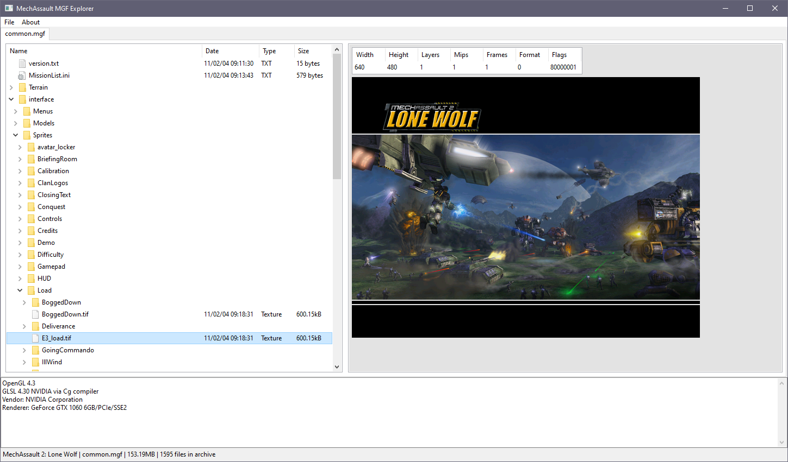
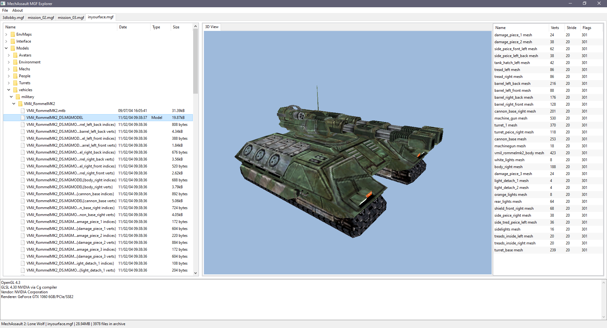

# About
MGF Explorer is a C++/wxWidgets GUI tool for opening and viewing assets contained within Meyer/Glass Interactive archive files used in MechAssault and MechAssault 2: Lone Wolf. This tool is heavily inspired by Adjutant, a similar tool for browsing .map files used in the Halo games. Please note that this application is early in development and a lot of features are not complete, especially the model viewer.

## Screenshots



# Instructions for use
The MGF files that come with MechAssault and MechAssault 2 are initially compressed, and must be decompressed before MGF-Explorer can open them.

These files can be decompressed using [offzip](http://aluigi.altervista.org/mytoolz/offzip.zip "http://aluigi.altervista.org/mytoolz/offzip.zip"). Once offzip is downloaded, run command prompt and navigate to the folder where offzip.exe is stored.
Use the following command to decompress an MGF archive:
```
offzip.exe -a -1 <mgf file dir> <output dir>
```

The result should be a decompressed version of the same file which can now be opened by MGF-Explorer.

MGF Explorer can have multiple MGF files opened, separated by tabs. The tree view on the left displays the entire contents of the archive, preserving the actual directory structure. If the "Type" column for a particular file says something (such as Strings or Texture), you can click on it and review the asset on the right.

# Current features
* Open MGF archive files and display the contents, preserving the directory tree structure
* Model viewer 
* Text viewer that can list all of the strings of .mgText files (only found within text.mgf)
* Texture viewer that can open and preview almost all textures found in an MGF file
	
# Planned features
* File extraction (and conversion to common third party formats)
* File injection

# Credits
* https://pugixml.org/
